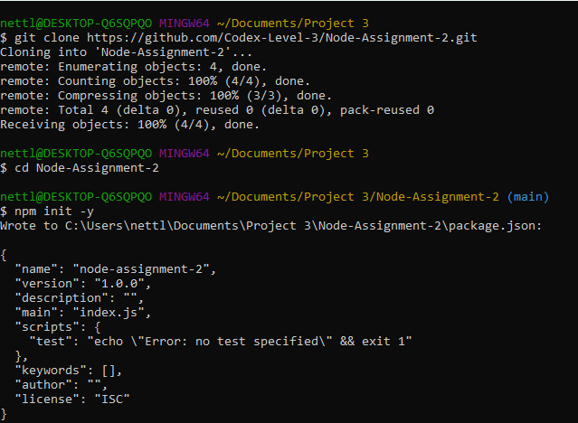
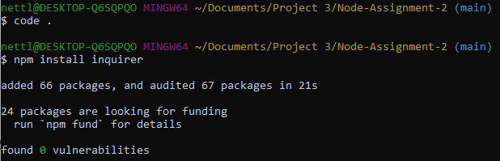
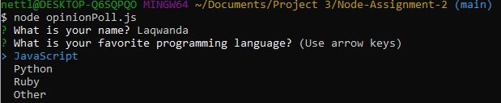
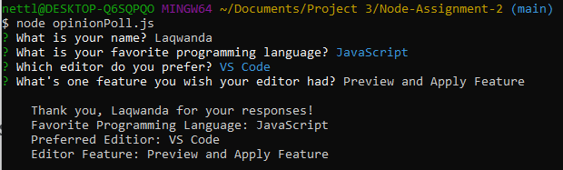

# Node-Assignment-2

## Objective

Demonstrate your understanding of the Inquirer package by creating a simple command-line application that gathers user opinions through interactive prompts. This application should ask the user a series of questions about their preferences on various topics, showcasing your ability to handle user input in Node.js.

## Initializing Repository

- Created a new repository name Node-Assignment-2.
- Initialized it with a README file and gitignore set to Node.

## Cloning Repository and Setting Up Project

- Opened git bash in my projects folder.
- Used the git clone command and Shift + Insert to paste my repository URL.
- Changed the directory to Node Assignment 2 with the command `cd Node-Assignment-2`.
- Intialized my repository as a Node package with the command `npm init -y`.

## Installing Inquirer

- Opened VS code with the ` code .` command.
- Installed inquirer with the `npm install inquirer` command.
  - Install shortcut : `npm i inquirer`
  - Uninstall : ` npm uninstall inquirer`

## Creating an Opinion Poll

- Created a JS file named opinionPoll.js.
- Imported inquirer and added type: module to package JSON file.
- Created a questions array containing objects with input and list types.
- Used then() method to console log the users answers and display them.

## Using the Opinion Poll

- With the command `node opinionPoll.js`, the prompt opens in the terminal.
- The first question/prompt appears, asking for the user's name? This one is an input type.
- The second and third questions are list types, which allow you to use your arrow keys to pick from the available options.

- The last one is also an input type, asking for your opinion.

### Here are the results:

## Summary

This application interacts with the user through a series of prompts generated using the Inquirer package in Node.js. It asks questions about the user's name, favorite programming language, preferred editor, and one feature they wish their editor had. After gathering the responses, it displays a summary of the user's opinions.
